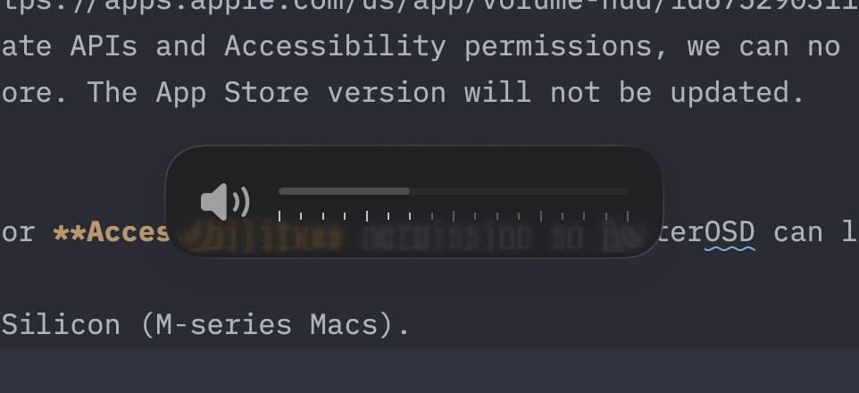

# BetterOSD

Bring back the classic volume feedback overlay to the center of your screen on macOS.

## Download
1. Download the latest **BetterOSD-arm64.dmg**: [Download](https://github.com/zmlabs/better-osd/releases/latest/download/BetterOSD-arm64.dmg)
2. Open the DMG and drag **BetterOSD.app** into **Applications**.
3. Launch the app.

## App Store
**App Store link:** https://apps.apple.com/us/app/volume-hud/id6752903119  
Due to the use of private APIs and Accessibility permissions, we can no longer ship updates via the App Store. The App Store version will not be updated.

## Notes
- You'll be prompted for **Accessibility** permission so BetterOSD can listen to media keys.
- Only supports Apple Silicon (M-series Macs).
