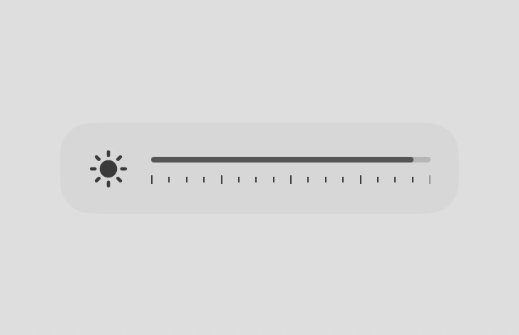
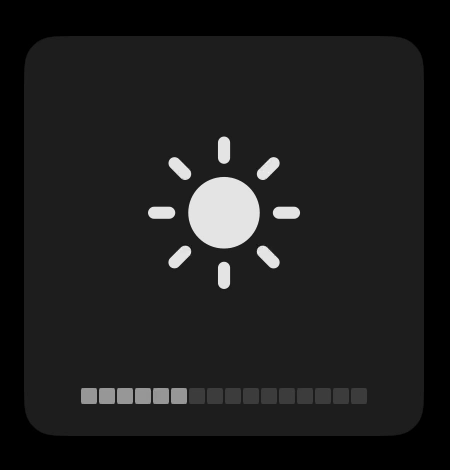
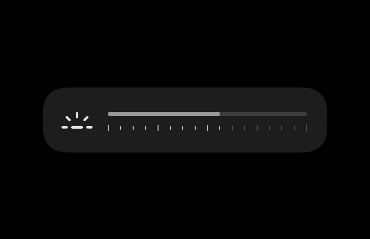

# BetterOSD

A custom on-screen display for volume, display brightness, and keyboard backlight on macOS — replacing the system HUD with a cleaner overlay you can actually customize.

> Apple Silicon only (M-series Macs) · macOS 26 (Tahoe)+

| Classic | Modern |
|:---:|:---:|
|  |  |
|  |  |

---

## Features

- **Volume** — replaces the system HUD for volume up/down and mute
- **Display brightness** — replaces the system HUD for F1/F2 brightness keys
- **Keyboard backlight** — new OSD for F5/F6 (or any key you configure)
- Two HUD styles: **Classic** (segmented bar) and **Modern** (pill with ticks)
- **Liquid Glass** effect with multiple variants
- Configurable position (bottom offset slider)
- Keyboard backlight key assignment — choose between F5/F6 or ⌘F1/⌘F2
- Launches at login, lives in the menu bar

---

## Download

1. Download the latest **BetterOSD-arm64.dmg**: [Download](https://github.com/zmlabs/better-osd/releases/latest/download/BetterOSD-arm64.dmg)
2. Open the DMG and drag **BetterOSD.app** into **Applications**
3. Launch — grant **Accessibility** permission when prompted

> **This fork** ships an unsigned build (no Apple Developer certificate).
> On first launch: right-click → **Open** → **Open**, or **System Settings → Privacy & Security → Open Anyway**.

---

## Settings

Open the menu bar icon → **Settings**.

| Section | What you can change |
|---|---|
| Appearance | HUD style, Liquid Glass on/off, glass variant, vertical position |
| Keyboard Backlight | Enable/disable OSD, choose key assignment (F5/F6 or ⌘F1/⌘F2) |
| General | Launch at login, show/hide menu bar icon |
| Updates | Auto-install updates |

### Keyboard backlight key assignment

Open **Settings → Keyboard Backlight**, enable the toggle, then pick your preferred key binding:

- **F5 / F6** — intercepts the standard illumination keys. BetterOSD also remaps F5/F6 to Dictation and Do Not Disturb at the system level so those functions are preserved alongside the OSD.
- **⌘F1 / ⌘F2** — intercepts Command + display-brightness keys. No system remapping applied; bare F1/F2 continue to control display brightness normally.

---

## How it works

BetterOSD installs a CGEvent tap (requires Accessibility permission) and intercepts media key events before they reach the system. For each key it handles, BetterOSD suppresses the native system HUD, applies the change itself, and shows its own overlay. Events it doesn't handle are passed through unchanged.

Keyboard backlight brightness is read and written via `CoreBrightness.framework` (`KeyboardBrightnessClient`). Display brightness uses `DisplayServices.framework`. Both are private Apple frameworks loaded at runtime.

---

## App Store

**App Store link:** https://apps.apple.com/us/app/volume-hud/id6752903119

Due to private API and Accessibility permission requirements, the App Store version is no longer updated. Download directly from GitHub instead.

---

## Building from source

```bash
git clone https://github.com/zmlabs/better-osd
cd better-osd
open BetterOSD.xcodeproj
```

Requires Xcode 16+ and macOS 13 SDK. No external dependencies beyond Swift Package Manager (Sparkle, LaunchAtLogin — resolved automatically).
